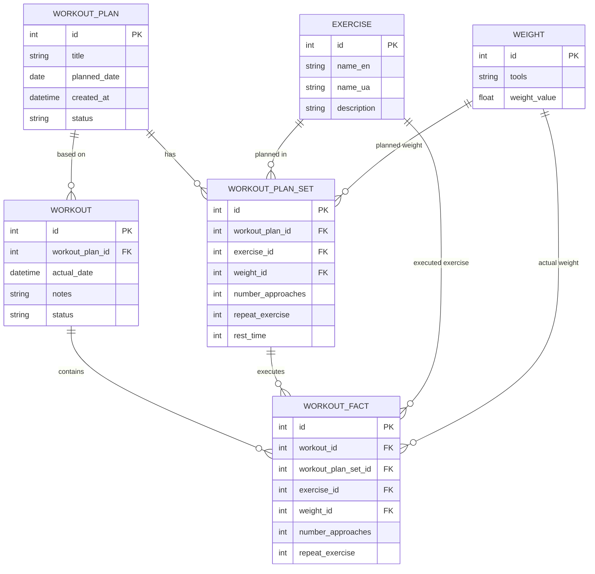

# Схема бази даних (ERD)

Цей документ візуалізує структуру бази даних для проекту Kettlebell Progress Tracker.

```mermaid
erDiagram
    WEIGHT {
        int id PK
        string tools
        float weight_value
    }
    EXERCISE {
        int id PK
        string name_en
        string name_ua
        string description
    }
    WORKOUT_PLAN {
        int id PK
        string title
        date planned_date
        datetime created_at
        string status
    }
    WORKOUT_PLAN_SET {
        int id PK
        int workout_plan_id FK
        int exercise_id FK
        int weight_id FK
        int number_approaches
        int repeat_exercise
        int rest_time
    }
    WORKOUT {
        int id PK
        int workout_plan_id FK
        datetime actual_date
        string notes
        string status
    }
    WORKOUT_FACT {
        int id PK
        int workout_id FK
        int workout_plan_set_id FK
        int exercise_id FK
        int weight_id FK
        int number_approaches
        int repeat_exercise
    }

    WORKOUT_PLAN ||--o{ WORKOUT_PLAN_SET : "has"
    EXERCISE ||--o{ WORKOUT_PLAN_SET : "planned in"
    WEIGHT ||--o{ WORKOUT_PLAN_SET : "planned weight"

    WORKOUT_PLAN ||--o{ WORKOUT : "based on"

    WORKOUT ||--o{ WORKOUT_FACT : "contains"
    WORKOUT_PLAN_SET ||--o{ WORKOUT_FACT : "executes"
    EXERCISE ||--o{ WORKOUT_FACT : "executed exercise"
    WEIGHT ||--o{ WORKOUT_FACT : "actual weight"
```
